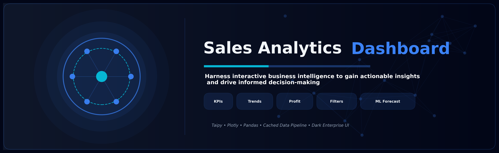
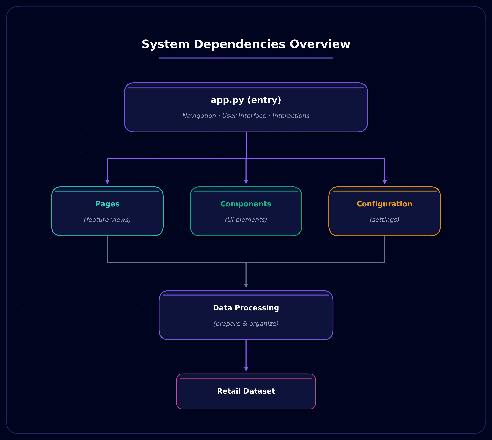
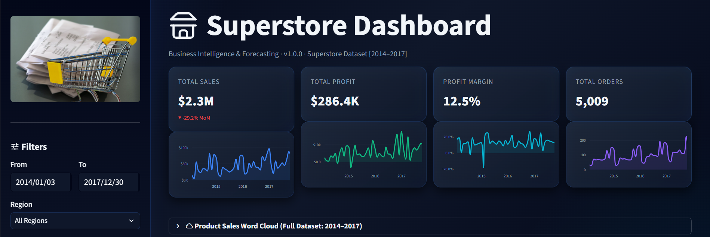
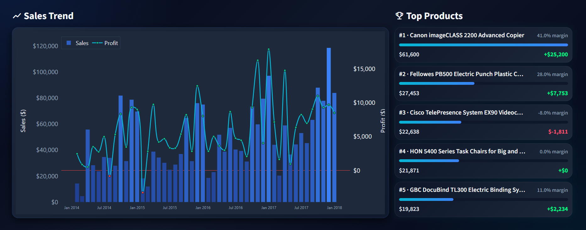
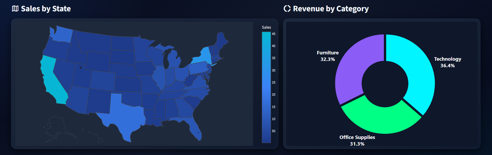
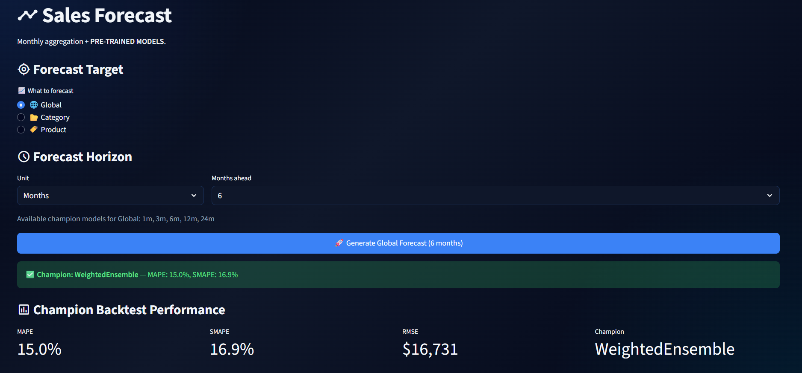
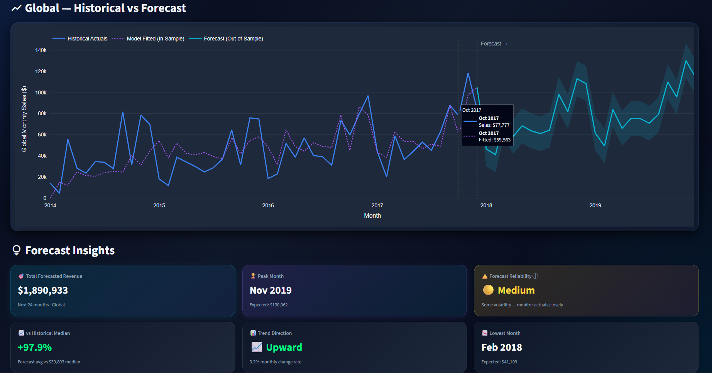
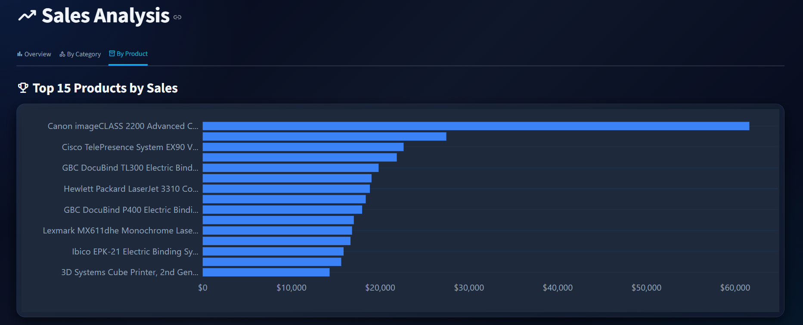
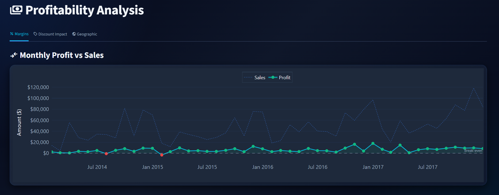
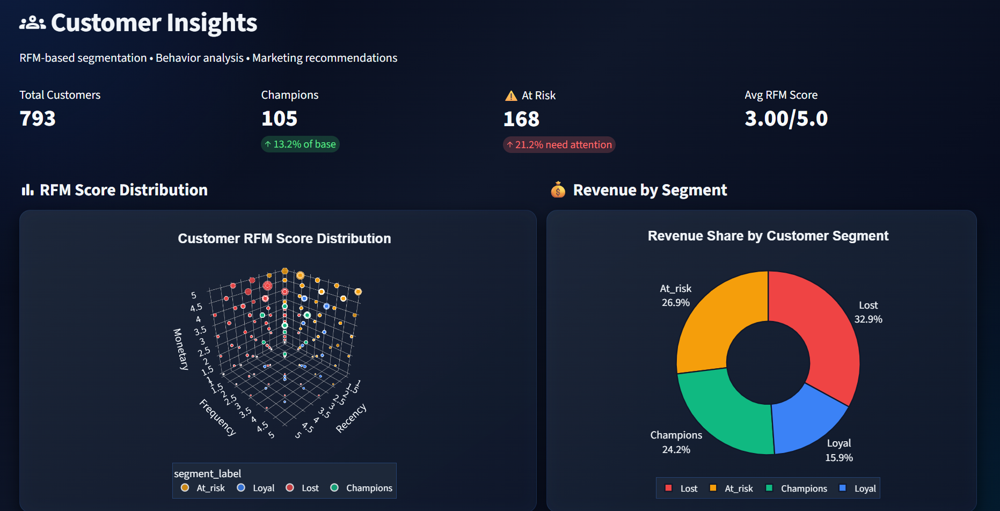

# 🚀 Intelligent Retail Analytics & Forecasting Platform

<p align="center">
  
</p>

<p align="center">

<p align="center">
  
  
  
  
  
  
  
  

</p>

[](http://superstore-bi-v1.streamlit.app)
[](YOUR_VIDEO_LINK_HERE)
[](https://github.com/mohanadcv/SuperStore-BI-V1.0.0/tree/main)


---

# 🌐 Live Application

### 🔗 Deployed Streamlit App

**Access the live platform here:**

👉 **[Open Interactive Demo](https://superstore-bi-v1.streamlit.app/)**

No installation required — the application is fully deployed and accessible through the browser.

---

# 📌 Overview

This project is an **end-to-end retail analytics and sales intelligence platform** designed to transform raw retail transaction data into **clear, actionable business insights**.

The platform combines **interactive analytics, forecasting, business intelligence dashboards, customer behavior analysis, and predictive insights** into a single streamlined environment.

Rather than overwhelming users with spreadsheets or static reports, the system focuses on **decision support** — helping users understand **what happened, why it happened, and what may happen next**.

Built with usability in mind, the platform enables users to:

- Explore retail performance interactively
- Understand trends across products and categories
- Monitor business KPIs
- Analyze customer purchasing patterns
- Forecast future sales performance
- Support data-driven operational planning

The goal was to create a system that feels practical, professional, and genuinely useful for real business scenarios.

---

## Project High Level Structure 

```
Superstore-BI-v1/
├── config/          # Application settings
├── data/            # Data resources
├── ml/              # Forecasting & segmentation
├── models/          # Models, pipelines, metadata, registries
├── analytics/       # business logic
├── components/      # Reusable interface components
├── pages/           # Application pages
├── assets/          # Images and media
├── utils/           # Shared helpers
├── tests/           # Full test suite mirroring project 
├── notebooks/       # EDA and experimentation notebooks
├── app.py           # Application entry point
└── pyproject.toml   # Project dependencies
```

<p align="center">
  
</p>


# ✨ Key Capabilities

## 📊 Interactive Analytics Dashboard

A modern analytics experience for exploring business performance through dynamic visualizations and KPI tracking.

Users can quickly understand:

- Revenue trends
- Sales performance
- Profitability
- Product/category behavior
- Historical business performance

The dashboard is designed to make complex retail data easier to interpret and navigate.

---

## 🔮 Sales Forecasting

The forecasting system enables future sales estimation across different business scopes.

Users can generate forecasts for:

- Overall business performance
- Product categories
- Individual products

Forecasts are presented visually alongside historical performance to improve interpretability and planning confidence.

The interface emphasizes usability, allowing users to explore multiple forecasting scenarios through an intuitive workflow.

---

## 🧠 Business Intelligence Insights

The platform provides intelligent summaries and business-oriented observations that help translate raw numbers into understandable patterns.

Instead of only showing metrics, the system highlights:

- Growth trends
- Seasonal behavior
- Performance changes
- Business opportunities
- Areas requiring attention

The objective is to reduce manual analysis effort and improve decision-making efficiency.

---

## 📦 Product & Category Exploration

Users can interactively explore product-level and category-level performance to identify:

- Best-performing segments
- Underperforming products
- Sales distribution patterns
- Revenue contribution trends

This makes it easier to evaluate inventory priorities and commercial performance.

---

## 📈 Visual Decision Support

The platform prioritizes **clarity and usability** through professional visual storytelling.

Instead of presenting raw tables alone, the system uses:

- Interactive charts
- Trend visualizations
- Comparative analytics
- KPI summaries
- Forecast confidence visualization

This makes insights easier to understand for both technical and non-technical users.

---

# 🖥️ Platform Walkthrough

The application is structured as a complete analytics workflow.

### 1. Executive Overview
A high-level business summary showing important KPIs, overall trends, and performance indicators.

### 2. Sales Analytics
Interactive exploration of historical sales behavior across multiple dimensions.

### 3. Profitability Insights
Detailed exploration of product segments and category-level performance.

### 4. Forecasting & Future Planning
Predictive analysis for estimating future business performance.

### 5. Intelligent Insights
Business-focused observations that assist with understanding patterns and making informed decisions.

---

# 📸 Application Preview

## 📊 Dashboard Overview

<p align="center">
  
</p>

*A high-level overview of business performance and operational KPIs.*

---

## 📈 Sales Analytics

<p align="center">
  
</p>
<p align="center">
  
</p>
*Interactive exploration of retail performance trends and business metrics.*

---

## 🔮 Forecasting Module

<p align="center">
  
</p>
<p align="center">
  
</p>
*Future sales estimation with historical comparison and planning insights.*

---

## 🏷️ Product Intelligence

<p align="center">
  
</p>
<p align="center">
  
</p>

*Product-level and category-level exploration for better decision-making.*

---
## 👥 Customer Intelligence
<p align="center">
  
</p>

*RFM-based customer segmentation, behavior analysis, and automated marketing recommendations.*

---
# 🎥 Demo Video

A complete walkthrough of the platform is available below.

👉 **Watch the Demo Here:**  
**[View Full Demonstration](YOUR_VIDEO_LINK_HERE)**

The video showcases:

- Platform navigation
- Dashboard capabilities
- Analytics workflow
- Forecast generation
- Interactive insights
- Real-time exploration features

---

# 💼 Why This Project Matters

Retail data is often fragmented, difficult to interpret, and underutilized.

This platform was designed to bridge the gap between **raw business data and practical decision-making** by providing an accessible environment where users can quickly explore trends, evaluate performance, and understand future possibilities.

The focus was not only on analytics, but on building a system that feels **practical, usable, and decision-oriented**.

---

# 🛠️ Technology Stack

The platform was developed using a modern data and analytics ecosystem.

<p align="center">
  
  
  
  
  
  <br/>
  
  
</p>

---

### ✍️ Author

**Mohanad Ahmed (Mo. A)**

🔗LinkedIn: [https://www.linkedin.com/in/mohanad-ahmed01](https://www.linkedin.com/in/mohanad-ahmed01)

🔗Github: [https://github.com/mohanadcv](https://github.com/mohanadcv)

## License


**Demo Purpose Only**

© 2026 [Mohanad Ahmed]. All rights reserved.

Looking for a custom analytics solution? 
**Hire me** → [LinkedIn](https://www.linkedin.com/in/mohanad-ahmed01e)

<p align="center">
  <big>✨ <strong>Custom dashboards, analytics, and ML solutions available.</strong> ✨</big>
</p>
---

<p align="center">
  <sub>Interactive BI dashboard for retail analytics · RFM customer segmentation · Sales forecasting with pre-trained ML/Time-series models · Discount & profitability analysis · US geographic visualization</sub>
</p>
<p align="center">
  <sub>Built with precision · Designed for scale · Ready for clients</sub>
</p>